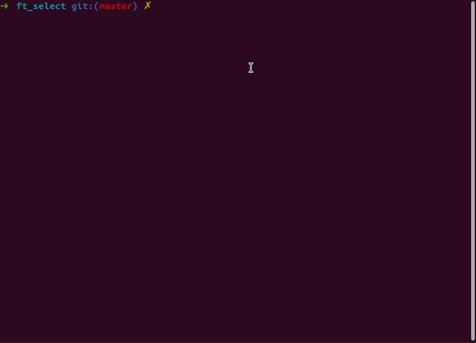
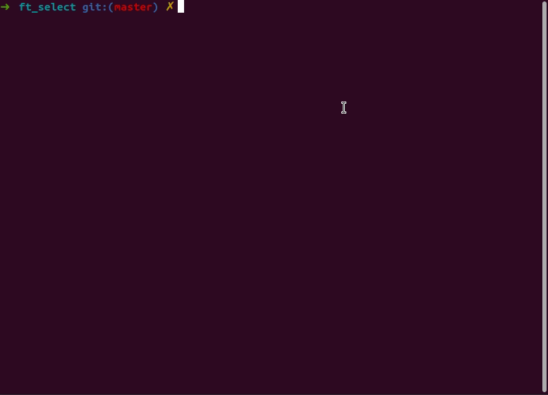

# 🌱 ft_select
<strong>Status: Finished/ Ungraded</strong><br/>
🥅 A recreation of simple bash shell. <br/>

<div></div>

<div></div>

☑️ Move throught the list with arrow keys &larr;&uarr;&darr;&rarr;. <br/>
☑️ Select/Unselect choice with <i>space</i> key. <br/>
☑️ Exit program with <i>esc</i> key. <br/>
☑️ Erase the element with <i>delete</i> or <i>backspace</i> key. <br/>
☑️ Validate the selection with the return key, the list of choices will be sent back to shell. <br/>
☑️ Resize of the window by the user.


## Usage
<i>compatible with MacOs and Linux</i>

```bash
$ make
$ ./ft_select [element1] [element2] ... [elementn]
```
